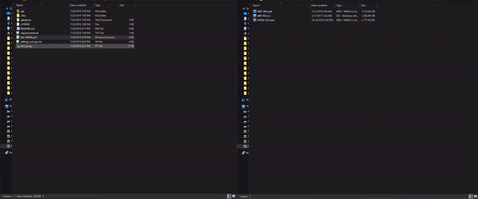

# JAV-Sort-Scrape-javlibrary Documentation
[](https://github.com/jvlflame/JAV-Sort-Scrape-javlibrary/releases)
[](#)
[](https://github.com/jvlflame/JAV-Sort-Scrape-javlibrary/commits/master)

The sort_jav Python script originally written by [/u/Ohura](https://reddit.com/user/Ohura) sorts and renames folder of unsorted JAV videos, downloads covers, and writes the raw JavLibrary page to html. The Set-JAVNfo PowerShell script will work in conjunction with sort_jav to create a functional .nfo metadata file from the html file for easy import into Emby, Jellyfin, Kodi, and/or Plex.

There are a settings you can configure, such as how the file is renamed, putting them in folders, or getting covers. Take a look in the [settings_sort_jav.ini](/settings_sort_jav.ini) file for the full set of options and documentation regarding them.

My goal in updating the sort_jav repository is for it to function as an alternative to the popular [JAVMovieScraper](https://github.com/DoctorD1501/JAVMovieScraper) which to my knowledge is currently unable to scrape JavLibrary data.

## Demo


[Old demo](https://gfycat.com/vibrantambitiouscoyote)
## Table of Contents:
* [Change Notes](#Change-Notes)
* [Prerequisites](#Prerequisites)
* [Folder Setup](#Folder-Setup)
* [How To Run](#How-To-Run)
* [Settings](#Settings)
* [Alternative Projects](#Alternative-Projects)
* [Additional Notes](#Additional-Notes)
* [Disclaimer](#Disclaimer)

## Change Notes
**Clone the repository to get the latest changes**

### v1.4.4
- Add option to crop cover image to poster size (378x533) for better viewing on Emby
- Fix html txt file not moving into folder if file already exists

### v1.4.3
- Add -Prompt parameter to Set-JAVNfo.ps1 to show changes before confirming. To remove, remove the parameter in the Set-JAVNfo.ps1 script on the last line
- Add option to add video genre as a 'tag' metadata option to allow for multi-genre/tag sorting in Jellyfin
- Fix video title erroring out and not writing to the proper file for some files

### v1.4.2
- Fix Set-JAVNfo.ps1 not finding metadata files txt metadata files for "t28" and titles with only 1 letter

### v1.4.1
- Fix paths containing square brackets error read/write through Set-JAVNfo.ps1

### v1.4
- Added option to include video genres in metadata nfo file
- Moved additional metadata options to bottom of settings.ini

### v1.3
- Added option in settings "include-html-txt" to create a html text file to parse and create Emby/Jellyfin/Kodi metadata
- Added Set-JAVNfo.ps1 script to create .nfo metadata from html text file
- Added option in settings "include-cover-all" to create a cover .jpg for each video file
- Changed renaming of cover to match video renaming for multiple part videos

### v1.2
- Fixed an issue where the program wouldn’t stop early during a problematic file
- Fixed an issue due to Cloudflare being added to javlibrary. This requires significantly
more setup from you, sorry about that but it was necessary.
- Fixed some issues where certain filenames didn’t sort properly because the name had
other portions that looked like IDs
### v1.1
- Fixed an issue where the program failed to work after javlibrary changed their HTML
structure for pages.
- Videos no longer have to be named correctly. The sorter can now determine what the ID
of the video is even if it has nonsense in the name. This may not work for every single
name, so please message me if you find ones that fail.

## Prerequisites
You must have Python 3.5 or higher installed in order for this to work. If you do not have it or are
unsure, you can download it here: https://www.python.org/downloads/ . This will likely no work
on Python 2.x, and has not been tested on it.

Due to javlibrary adding Cloudflare, you are now required to have cfscrape installed. You can
view how to install it here: https://github.com/Anorov/cloudflare-scrape#installation . You will
need node.js installed to run it. Please refer to their respective documentation on installation.

```
# Required to crop cover images
$ pip install Pillow
# Required to scrape JavLibrary
$ pip pip install cfscrape
```

You will need PowerShell v5.0 or higher installed to run Set-JAVNfo.ps1 (installed on Windows 10 by default). If you get a Remote-ExecutionPolicy error when running, open an **administrator** PowerShell prompt, and run the following to unrestrict the script:
```
Set-ExecutionPolicy Unrestricted
```

## Folder Setup
### sort_jav.py
To run sort_jav.py, you need to set it up so all the videos you want to sort are all in a single folder, and that folder is
the path you specify in the settings. Any files in folders within that folder will be ignored, so you
can move them out of folders they may already be in.

Videos no longer need to be renamed, the sorter can now handle this. Videos with multiple files
that are not tagged correctly may fail to sort. The sorter will not remove any of these files, just
fail to sort them correctly. There are two formats that the sorter will understand for multiple
videos:

1. A letter appears directly after the end of the video ID, for example MIRD150A and
MIRD150B. It will detect them as two files for the same video and rename them
accordingly.
2. The old system method, where the video title has the multiple video suffix attached. For
example, if multiple videos are denoted by a ! symbol and the video is MIRD-150!A and
MIRD-150!B, the sorter will understand.

### Set-JAVNfo.ps1
To run Set-JAVNfo.ps1, the files need to be in the path specified in the settings. The script will search the folder recursively, finding all .txt files containing the html metadata.

## How To Run
Please first edit the settings to match your desired preferences. It will not work if you do not do this, particularly with the folder you need to specify.

Once the settings are good, you can double click sort_jav.py to run it. A box should pop up and
stay open while running the script, giving you details about what’s happening. It will give you
another message when it finishes, and hitting enter will close the program at that point.
Alternatively you can invoke it from the command line. A note that this requires .py files to be
associated with the Python executable file (Python.exe for most of us).

To run Set-JAVNfo.ps1, right click and select "Run with PowerShell" (double clicking will **NOT** work). By default, the script will run on the path in your settings file. If you want to run the Set-JAVNfo.ps1 script on a different directory, add the `FilePath` parameter to Set-JAVNfo.ps1 on the last line.

You can also invoke both scripts from a **non-administrator** PowerShell prompt as demonstrated in the demo.

## Settings
The `settings_sort_jav.ini` file provided lists the options the user has available to them as well as descriptions on those options.

For settings that say true/false, please use the values true or false to indicate. For other values,
it will use whatever appears directly after the = sign on the same line.

Please note that where it gives you options to include delimiters, certain characters are
disallowed by the OS. If you include them, they will be forcibly removed from your delimiter. For
windows, that would be: / \ : * ? < > |

## Additional Notes
Any video files that can’t be found on javlibrary will be ignored. The program will notify you of
any problems it has trying to sort them.

Occasionally the results will be incorrect, this is because javlibrary incorrectly states the id of the
video on their website. You should double check all the results appear to be correct.

Videos with the id code r18 or t28 cannot be detected with the new special method, so the
program defaults to the old method. For videos with those names, please rename them before
running the program.

If a video is renamed to something that is too long, the program will ignore moving it. This may
result in a folder being created but files not being placed in there. For reference, maximum file
lengths are around 255, so for videos with several actresses in them, it’s best not to include the
actress name in both the file and folder.

When fixing movies that have been scraped improperly, you can manually download the proper JAVLibrary page as an html, and then add
```<ActressSorted>Actress1|Actress2|Actress3</ActressSorted>``` to the last line of the html, and then rename it to the .txt extension. You can then run Set-JAVNfo.ps1 to write the .nfo metadata file.

## Alternative Projects
[JAVMovieScraper](https://github.com/DoctorD1501/JAVMovieScraper) - Scrape multiple JAV databases (or western) and rename/categorize and write metadata

[Rename-JAV-files-javlibrary](https://github.com/jvlflame/Rename-JAV-files-javlibrary) - Use regex checks to rename JAV files to their ID format. No web scraping involved.

## Disclaimer
This script is provided “as is” and the creator is not liable for anything that happens as a result
of the use of it.

This being said, if you experience any issues with it, feel free to ask for help.

## To do

- [x] Add option to input tags/genres in metadata file
- [x] Add functionality to crop cover to poster size
- [ ] Add video title option to renamed file
- [ ] Scrape video plot/description
- [ ] Scrape actress images
