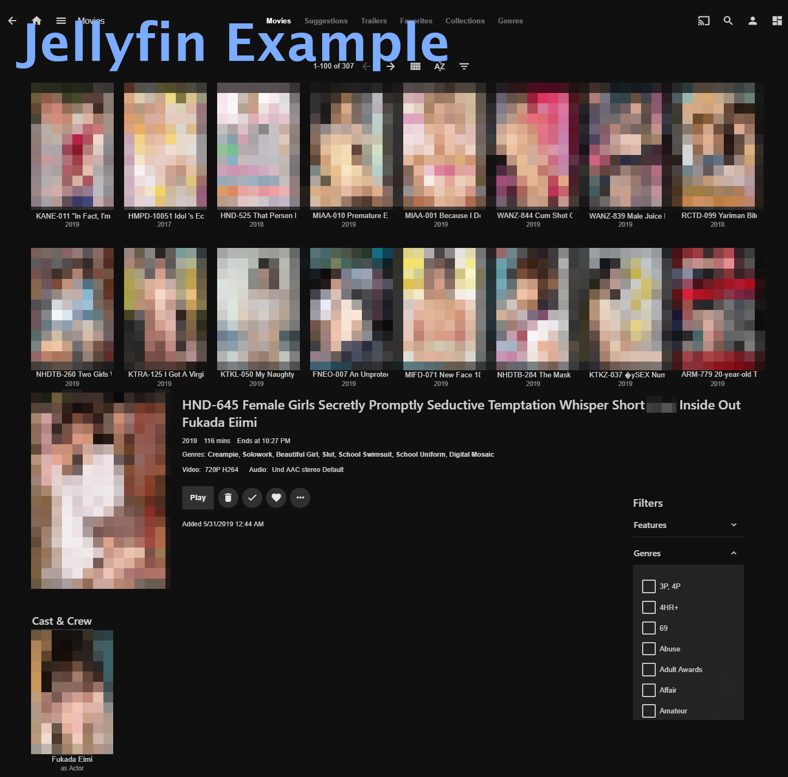

# JAV-Sort-Scrape-javlibrary

[](https://github.com/jvlflame/JAV-Sort-Scrape-javlibrary/releases)
[](#)
[](https://github.com/jvlflame/JAV-Sort-Scrape-javlibrary/commits/master)
[](https://discord.gg/K2Yjevk)

The JAV-Sort-Scrape-javlibrary repository is a series of scripts used to manage your local JAV (Japanese Adult Video) library. It automatically scrapes content from JavLibrary and R18 to create an easily usable content library within Emby or Jellyfin. My goal in maintining this project is for it to function as a simple and lightweight alternative to [JAVMovieScraper](https://github.com/DoctorD1501/JAVMovieScraper). If you have any questions, criticisms, or requests, or want to be kept up-to-date of any new features and releases, feel free to hop into my [discord channel](https://discord.gg/K2Yjevk).

Big thanks to the original author of the sort_jav.py script [/u/Oppaira](https://reddit.com/user/Oppaira).

## Demo

[**Emby thumbnail demo**](https://gfycat.com/kindheartedethicalgerenuk)




## Table of Contents:

-   [Changelog](#Change-Notes)
-   [Getting Started](#Getting-Started)
-   [Usage](#Usage)
-   [Notes](#notes)
-   [FAQ](#FAQ)
-   [Feature Ideas](#Feature-Ideas)

## Changelog

**Older changes have been moved to the [wiki.](https://github.com/jvlflame/JAV-Sort-Scrape-javlibrary/wiki)**

### v.1.5.2 (Current version)

-   Additions
    -   Add setting `prefer-r18-title` to prefer r18 title for video metadata
    -   Add setting `do-not-rename-file` to run sort_jav.py without renaming video files

-   Fixes
    -   Fix html causing inconsistencies on video titles in Emby
    -   Fix Set-JAVNfo.ps1 not writing metadata for videos with naming starting with "R18"
    -   Fix R18 titles not scraping with PowerShell 6.0+

### v.1.5.1

-   Fixes
    -   Fix error causing nfo metadata file not being read by Emby
    -   Fix Set-JAVNfo.ps1 file compatibility with PowerShell Core 6.0+

### v1.5.0 (broken build)

-   Additions
    -   Scrape R18.com actor thumbnails and push to Emby/Jellyfin
    -   Add video part number in metadata title for multipart videos
-   Changes
    -   Repository file structure changed to be more user accessible
    -   Use ratio based crop rather than absolute when cropping movie covers to poster size
-   Fixes
    -   Widen .jpg file match to crop all covers properly in edit_covers.py
    -   Fix encoding option on javlibrary html to allow better reading of special characters

## Getting Started

### Prerequisities

-   [Python 3.5+](https://www.python.org/downloads/)
    -   [Pillow](https://pypi.org/project/Pillow/)
    -   [cfscrape](https://pypi.org/project/cfscrape/) - requires Node.js
-   [PowerShell 5.0 or higher (6.0+ recommended)](https://github.com/PowerShell/PowerShell)

### Installing

[Clone this repository (recommended)](https://github.com/gboudreau/XBMCnfoMoviesImporter.bundle/archive/master.zip) or [download the latest release](https://github.com/jvlflame/JAV-Sort-Scrape-javlibrary/releases).

#### Install Pillow module on Python

```
# Required to crop cover images
pip install Pillow
```

#### Install cfscrape module on Python

```
# Required to scrape JavLibrary
pip install cfscrape
```

#### Install Node.js

Download and install from [here](https://nodejs.org/en/download/).

#### You will need PowerShell v5.0 or higher installed to run any of the .ps1 scripts (PowerShell 5.0 is installed on Windows 10 by default). If you get a Remote-ExecutionPolicy error when running, open an **administrator** PowerShell prompt, and run the following to unrestrict the scripts:

```
Set-ExecutionPolicy Unrestricted
```

## Usage

**Before running any of the scripts, configure your settings in `settings_sort_jav.ini`**. Documentation for each option is listed in the settings file, with defaults set to my best practice guideline. Most notably, you will need to change each of the path settings to match your local directory structure. Completely read through this section, the [Notes](#Notes), and [FAQ](#FAQ) section before using.

If you are running this for the first time and you have many directories of videos, you can run the `sort_jav.py` or `Set-JAVNfo.ps1` scripts concurrently with many different paths. Simply edit the `path` in your settings file, save, and run the script. Edit `path` and run again, etc.

**_To run PowerShell (.ps1) scripts, right click the file and select "Run with PowerShell". To run Python (.py) scripts, double click to run._** You can also invoke the scripts from a **non-administrator** shell like shown in the demo.

### Run order

The scripts are numbered in the order that they should be run. They were written with ease-of-use in mind, so they are a one-click solution once your settings are configured properly.

1. Run `sort_jav.py` to sort your JAV files. - **_Stop here if you don't use any media servers that use .nfo metadata_**

2. Run `Set-JAVNfo.ps1` to create .nfo metadata files for each video. **_Stop here if you don't use Emby or Jellyfin, or you don't want actor images_**

    - You can re-run this script on existing directories to replace old metadata files if you make changes to your settings

3. Go to your Emby server and make sure all your videos are imported. This is important, as the next step will call Emby's API to get your current actor list.

4. Run `Get-R18ThumbUrls.ps1` to scrape R18 and get actor thumbnail urls and write to .csv spreadsheet specified in `r18-export-csv-path` (you only need to do this once every so often when new actors are added to R18).

    - I have provided two recently scraped spreadsheets in the repository as `emby_actor_thumbs/R18-Aug-30-2019.csv` Use last-first if your `name-order` in your settings is set to _last_, and vice-versa.

5. Run `Get-EmbyActorThumbs.ps1` to get Emby actor name/id to compare with R18 spreadsheet and create a .csv spreadsheet specified in `actor-csv-export-path`. Make sure the spreadsheet you created in `Get-R18ThumbUrls.ps1` is specified in `r18-export-csv-path` as it will be referenced in this script.

    - After creating this spreadsheet, you can modify specific actor images manually
    - You can re-run this script after importing new videos/actors into Emby to update your spreadsheet

6. Run `Set-EmbyActorThumbs.ps1` to import actor images into Emby. It will import based on the spreadsheet specified in `actor-csv-export-path`. A .csv database will be created to record all changes made to your actor images specified in `actor-csv-database-path`.

    - After your first write to Emby, your .csv database will be created
    - Any changes made to your `actor-csv-export-path` file will be compared to the database in `actor-csv-database-path` and be written accordingly

## Notes

### sort_jav.py

-   Matches your jav file and scrapes javlibrary for content
-   Renames and sorts your jav file to your specified settings

sort_jav.py will run a non-recursive search of video files located in the `path` specified in your settings file. Files located in folders will not be detected.

If you are trying to sort a video with multiple parts, follow any of the naming schemas below:

1. MIRD-151A, MIRD-151B

2. MIRD151A, MIRD-151B

3. MIRD-151[delimiter-between-multiple-videos]A, MIRD-151[delimiter-between-multiple-videos]B

4. MIRD-151[delimiter-between-multiple-videos]1[delimiter-between-multiple-videos], MIRD-151[delimiter-between-multiple-videos]2[delimiter-between-multiple-videos]

### Set-JAVNfo.ps1

-   Matches all html .txt files created by sort_jav.py
-   Creates a .nfo metadata file that is readable by Media servers like Emby/Jellyfin

`Set-JAVNfo.ps1` will run a recursive search of .txt files located in the `path` specified in your settings file. A .nfo metadata file will be generated with information such as title, release date, studio, genres, and actors. Set `prefer-r18-titles` true to do an additional scrape of R18(.)com for better translated titles in your metadata.

### Get-R18ThumbUrls.ps1

-   Scrapes R18 for all actor thumbnails and creates a csv database for Actor-ThumbnailUrl

`Get-R18ThumbUrls.ps1` will take a while to run, as it needs to parse over 300 pages of R18 actors. I have provided recent (Aug-30-2019) scrape files created with this script for you to use if you do not want to create your own file. Use `R18-Aug-30-2019-last-first.csv` if you have `name-order` set to _last_, and vice versa. Specify this path in `r18-export-csv-path`.

### Get-EmbyActorThumbs.ps1

-   Calls Emby/Jellyfin API to get a list of actors and their IDs
-   Matches names of both Emby actor list and R18 csv database created by Get-R18ThumbUrls
-   Creates a modifiable .csv spreadsheet to import into Emby

`Get-EmbyActorThumbs.ps1` will parse the R18ThumbUrl .csv and match with your Emby/Jellyfin actor list generated by an API call. A new spreadsheet will be created for direct import. You can modify this spreadsheet by hand if you want to add/delete/update external actor images (such as from WAPdB) in Emby/Jellyfin. You can also run this script again after adding new videos/actors into Emby to update the spreadsheet with new actors.

### Set-EmbyActorThumbs.ps1

-   Reads csv spreadsheet created by Get-EmbyActorThumbs.ps1 and imports matching thumbnails into Emby/Jellyfin using API
-   Creates an up-to-date csv database of all API calls made to Emby/Jellyfin

`Set-EmbyActorThumbs.ps1` will read the csv created by `Get-EmbyActorThumbs.ps1` and import new actor images to Emby while writing a separate csv database of all changes made. If the csv database already exists, it will be compared to your actor csv and only import new changes.

### edit_covers.py

-   Finds all original thumbnail-size covers and creates an extra poster-size cover

`edit_covers.py` is deprecated past v1.4.5. Only use this script if you are using a very old version that did not have poster covers and you want to add them to your already scraped files.

### settings_sort_jav.ini

Please note that where it gives you options to include delimiters, certain characters are
disallowed by the OS. If you include them, they will be forcibly removed from your delimiter. For
windows, that would be: / \ : \* ? < > |

## FAQ

### My video isn't being sorted by sort_jav.py

Try renaming your file exactly how it appears on javlibrary. If it still doesn't work for some reason, follow the instructions below to manually sort the file.

### "Could not find video on javlibrary so skipping..." for all files

This problem likely stems from the cfscrape module failing. First ensure that both cfscrape AND Node.js are installed properly (restart computer after installing Node.js). If that still does not work, run `pip install -U cfscrape` to upgrade your cfscrape module.

### The video was sorted by sort_jav.py, but it's the wrong video

Occasionally the results will be incorrect due to there being multiple videos with the same title. To manually sort the file, go to the correct javlibrary page, and save the page as an html. Also save the cover image. Rename the .html to a .txt, and rename both the cover and .txt the same as the video. Run Set-JAVNfo.ps1 and it will create a metadata file for you. To create a poster cover, you can either crop it yourself, or run the `edit_covers.py` script with the FULL directory path of your manually sorted files set in the settings path.

### r18 and t28 videos aren't being sorted

For these special cases, rename the files to exactly how they appear on javlibrary. Anything extra in the video name will cause it not to sort. If you have a lot of them, check out my [JAV renamer script](https://nodejs.org/en/download/).

### Shell closes immediately after erroring

Try calling the scripts through a shell window rather than double-clicking to run. You will be able to diagnose what the issue is through the error messages.

### Not all my actresses have thumbnail images

Unfortunately R18 and javlibrary use different English naming conventions for their actresses, so until I have a solution in place to either scrape Japanese, or do some manual switcharoos, we'll have to deal with it. You can also manually put in image urls into the .csv specified in `actor-csv-export-path`.

## Feature ideas

-   [x] Add option to input tags/genres in metadata file - v.1.4.0
-   [x] Add functionality to crop cover to poster size - v1.4.4
-   [x] Scrape actor images and push to Emby - v1.5.0
-   [ ] Add option to do recursive search on sort_jav.py
-   [ ] Add option to manually scrape a javlibrary url if it can't match automatically
-   [ ] Add more video title renaming options
-   [ ] Scrape video plot/description
